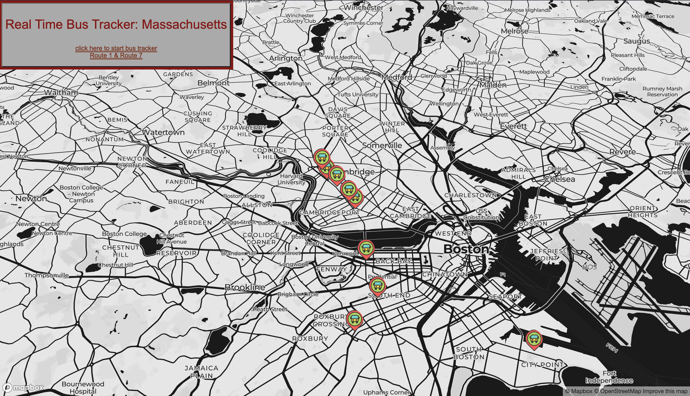

# Real-Time-Bus-Tracking

The Real-Time-Bus-Tracking exercise was created for MITxPro full-stack web development program.  

<a href="https://foreverphoenix21.github.io/Real-Time-Bus-Tracking/">
   </a
>

## Description:

 The Real-Time-Bus-Tracking program is a project that uses the MTBA API and actively tracks the busses on routes 1 and 7 in Massachusetts, United States. Mapbox was used for this project, and the coordinates for the bus routes were pulled from the MTBA V3-API developer resources website.

## Installation:

 Upload the HTML file to your browser or fork and clone the project saving the files to your local hard drive. 
 

You can also run the program by clicking on the above picture in this readme file.

## Usage:

 This exercise was made to demonstrate asynchronous programing techniques with the use of map markers.
You can use these files as a learning template to play with API's and JSON Files changing the map and route destinations.

## Roadmap:

*
 This exercise will continually be built and improved on as I learn additional skills in Javascript. 
*

***

**
 Future updates: 
**
- Add a real time tracker that updates each bus's occupational status, direction traveled, and more. 
- Add subway routes
- Create buttons for different active bus and subway routes. 
- Create different real time trackers for other states. NYC, Denver, and San Fransico. 

## Support:

 Want to share feedback or comments?

 
  
  Reach me on *[Linkedin](https://www.linkedin.com/in/derek-diaz/)* or *[Twitter](https://twitter.com/diazcsu.*
  

